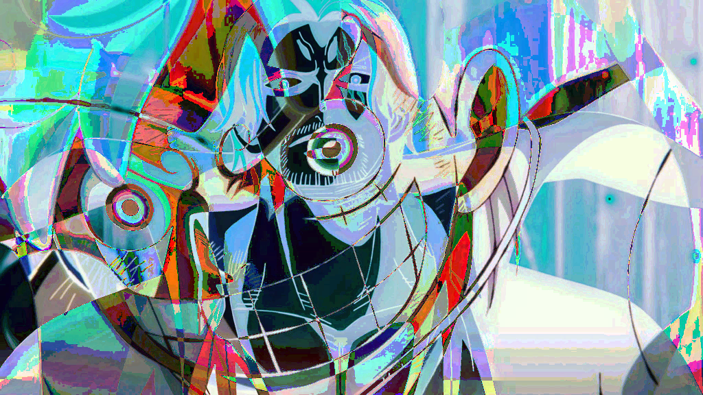

# LABORATORIO 2

## LABORATORIO 2 PARTE A

### Conversión de Texto a Binario

Este proceso convierte cada carácter de una cadena en su representación binaria de 8 bits (ASCII).

**Ejemplo:**
Texto original: `Hola, mundo!`

**Salida:**
```
H -> 01001000
o -> 01101111
l -> 01101100
a -> 01100001
, -> 00101100
  -> 00100000
m -> 01101101
u -> 01110101
n -> 01101110
d -> 01100100
o -> 01101111
! -> 00100001
```

Texto en binario: `010010000110111101101100011000010010110000100000011011010111010101101110011001000110111100100001`

**Ejemplo:**
Texto original: `Esto es una prueba de cifrado`

Texto en binario: `0100010101110011011101000110111100100000011001010111001100100000011101010110111001100001001000000111000001110010011101010110010101100010011000010010000001100100011001010010000001100011011010010110011001110010011000010110010001101111`

---

### Conversión de Binario a ASCII

Cada conjunto de 8 bits se traduce a su carácter ASCII correspondiente.

**Ejemplo:**
Entrada binaria:
`010010000110111101101100011000010010110000100000011011010111010101101110011001000110111100100001`

**Salida:** `Hola, mundo!`

```

01001000 -> H
01101111 -> o
01101100 -> l
01100001 -> a
00101100 -> ,
00100000 ->
01101101 -> m
01110101 -> u
01101110 -> n
01100100 -> d
01101111 -> o
00100001 -> !
```

**Ejemplo:**
Entrada binaria:
`0100010101110011011101000110111100100000011001010111001100100000011101010110111001100001001000000111000001110010011101010110010101100010011000010010000001100100011001010010000001100011011010010110011001110010011000010110010001101111`

**Salida:** `Esto es una prueba de cifrado`

---

### Conversión de Texto a Base64

Este proceso convierte el texto a Base64 siguiendo los pasos:

1. Convertir el texto a binario.
2. Agrupar en segmentos de 6 bits.
3. Convertir cada grupo a su valor Base64.

**Ejemplo:**
Texto original: `Hola, mundo!`

```
H -> 01001000
o -> 01101111
l -> 01101100
a -> 01100001
, -> 00101100
  -> 00100000
m -> 01101101
u -> 01110101
n -> 01101110
d -> 01100100
o -> 01101111
! -> 00100001
Bits originales: 96
Bits rellenados: 0
['010010', '000110', '111101', '101100', '011000', '010010', '110000', '100000', '011011', '010111', '010101', '101110', '011001', '000110', '111100', '100001']
SG9s
YSwg
bXVu
ZG8h
No es necesario agregar relleno
```

Salida Base64: `SG9sYSwgbXVuZG8h`


**Ejemplo:**
Texto original: `Esto es una prueba de cifrado`
Salida Base64: `RXN0byBlcyB1bmEgcHJ1ZWJhIGRlIGNpZnJhZG8=`
---

### Conversión de Base64 a Texto

Cada carácter Base64 se convierte a binario de 6 bits y luego a ASCII.

**Ejemplo:**
Entrada Base64: `SG9sYSwgbXVuZG8h`

```
Valores binarios de 6 bits por cada caracter:
010010
000110
111101
101100
011000
010010
110000
100000
011011
010111
010101
101110
011001
000110
111100
100001
Valores binarios concatenados:
010010000110111101101100011000010010110000100000011011010111010101101110011001000110111100100001
Nueva division de bloques de 8 bits:
01001000 -> H
01101111 -> o
01101100 -> l
01100001 -> a
00101100 -> ,
00100000 ->
01101101 -> m
01110101 -> u
01101110 -> n
01100100 -> d
01101111 -> o
00100001 -> !
```

Salida: `Hola, mundo!`

**Ejemplo:**
Entrada Base64: `RXN0byBlcyB1bmEgcHJ1ZWJhIGRlIGNpZnJhZG8=`
Salida: `Esto es una prueba de cifrado`

---

### Operación XOR con Cadenas de Texto

Se realiza una operación XOR bit a bit entre una cadena y una llave. Si la llave es menor, se repite hasta igualar el tamaño del texto.

**Ejemplo:**
Texto: `Hola, mundo!`
Llave: `perro`

Salida cifrada:
`001110000000101000011110000100110100001101010000000010000000011100011100000010110001111101000100`

```
Ingrese la llave: perro 
Llave:
perroperrope

Texto a binario :
H -> 01001000
o -> 01101111
l -> 01101100
a -> 01100001
, -> 00101100
  -> 00100000
m -> 01101101
u -> 01110101
n -> 01101110
d -> 01100100
o -> 01101111
! -> 00100001

Llave a binario :
p -> 01110000
e -> 01100101
r -> 01110010
r -> 01110010
o -> 01101111
p -> 01110000
e -> 01100101
r -> 01110010
r -> 01110010
o -> 01101111
p -> 01110000
e -> 01100101

Texto cifrado con XOR:
Operacion XOR:
0 XOR 0 = 0
1 XOR 1 = 0
0 XOR 1 = 1
0 XOR 1 = 1
1 XOR 0 = 1
0 XOR 0 = 0
0 XOR 0 = 0
0 XOR 0 = 0
0 XOR 0 = 0
1 XOR 1 = 0
1 XOR 1 = 0
0 XOR 0 = 0
1 XOR 0 = 1
1 XOR 1 = 0
1 XOR 0 = 1
1 XOR 1 = 0
0 XOR 0 = 0
1 XOR 1 = 0
1 XOR 1 = 0
0 XOR 1 = 1
1 XOR 0 = 1
1 XOR 0 = 1
0 XOR 1 = 1
0 XOR 0 = 0
0 XOR 0 = 0
1 XOR 1 = 0
1 XOR 1 = 0
0 XOR 1 = 1
0 XOR 0 = 0
0 XOR 0 = 0
0 XOR 1 = 1
1 XOR 0 = 1
0 XOR 0 = 0
0 XOR 1 = 1
1 XOR 1 = 0
0 XOR 0 = 0
1 XOR 1 = 0
1 XOR 1 = 0
0 XOR 1 = 1
0 XOR 1 = 1
0 XOR 0 = 0
0 XOR 1 = 1
1 XOR 1 = 0
0 XOR 1 = 1
0 XOR 0 = 0
0 XOR 0 = 0
0 XOR 0 = 0
0 XOR 0 = 0
0 XOR 0 = 0
1 XOR 1 = 0
1 XOR 1 = 0
0 XOR 0 = 0
1 XOR 0 = 1
1 XOR 1 = 0
0 XOR 0 = 0
1 XOR 1 = 0
0 XOR 0 = 0
1 XOR 1 = 0
1 XOR 1 = 0
1 XOR 1 = 0
0 XOR 0 = 0
1 XOR 0 = 1
0 XOR 1 = 1
1 XOR 0 = 1
0 XOR 0 = 0
1 XOR 1 = 0
1 XOR 1 = 0
0 XOR 1 = 1
1 XOR 0 = 1
1 XOR 0 = 1
1 XOR 1 = 0
0 XOR 0 = 0
0 XOR 0 = 0
1 XOR 1 = 0
1 XOR 1 = 0
0 XOR 0 = 0
0 XOR 1 = 1
1 XOR 1 = 0
0 XOR 1 = 1
0 XOR 1 = 1
0 XOR 0 = 0
1 XOR 1 = 0
1 XOR 1 = 0
0 XOR 1 = 1
1 XOR 0 = 1
1 XOR 0 = 1
1 XOR 0 = 1
1 XOR 0 = 1
0 XOR 0 = 0
0 XOR 1 = 1
1 XOR 1 = 0
0 XOR 0 = 0
0 XOR 0 = 0
0 XOR 1 = 1
0 XOR 0 = 0
1 XOR 1 = 0

Texto cifrado:
001110000000101000011110000100110100001101010000000010000000011100011100000010110001111101000100

Texto cifrado a ascii:
00111000 -> 8
00001010 ->

00011110 -> ▲
00010011 -> ‼
01000011 -> C
01010000 -> P
00001000 ->
00000111 ->
00011100 -> ∟
00001011 ->

00011111 -> ▼
01000100 -> D
Texto cifrado: 8
▲‼C∟
▼D

```

Texto cifrado en ASCII: `8▲‼C∟▼D`

**Ejemplo:**
Texto: `Esto es una prueba de cifrado`
Llave: `perro`
Salida cifrada:
`0011010100010110000001100001110101001111000101010001011001010010000001110000000100010001010001010000001000000000000110100001010100000111000100110101001000001011000101010100010100010001000110110000100100000010000001000001011000011101`

## LABORATORIO 2 PARTE B

### Desifrar imágen encriptada con clave "cifrados_2025"

Proceso:

1. Convertir imágen corrupta a base 64
2. Convertir clave e imágen a binario
3. Aplicar xor con los dos textos binarios
4. Convertir binario a bytes
5. Recuperar imágen

```def descifrar_imagen(base64_cifrado, llave):
    # Convertir Base64 a binario
    binario_cifrado = conv.base64_a_binariox(base64_cifrado)

    # Expandir la llave para igualar la longitud del binario cifrado
    llave_binaria = ''.join(format(ord(c), '08b') for c in (llave * (len(binario_cifrado) // len(llave)) + llave[:len(binario_cifrado) % len(llave)]))

    # Aplicar XOR
    binario_descifrado = k.xor_binario(binario_cifrado, llave_binaria)

    # Convertir binario a bytes
    imagen_original = conv.binario_a_bytes(binario_descifrado)

    # Guardar la imagen
    with open("imagen_recuperada.png", "wb") as f:
        f.write(imagen_original)
```

#### Imágen descifrada


<b> ¿Porque al aplicar XOR con una llave de texto la imagén se corrompe? </b>
<br>
<br>
Esto puede suceder debido a que es posible que mediante el xor se cambien los datos del encabezado de la imágen, por o que puede resultar en una imagen irrecnocible o inclusio se tiene la posibilidad de no poder visuelizarla.

### Combinar 2 imágenes y aplicar xor entre ellas.

Proceso:

1. Cargar las imágenes con PIL Image.open y las convierte a RGB
2. Se cambia el tamaño de la imagen llave, en este caso shanks.jpg
3. Aplicar XOR entre las imágenes utilizando numpy
4. crear la nueva imágen a partir del XOR resultante
5. Guardar la imágen.

```def cargar_imagen(ruta, size=None):
    img = Image.open(ruta).convert("RGB")  # Convertir a RGB
    if size:
        img = img.resize(size)  # Ajustar tamaño si es necesario
    return np.array(img)

def aplicar_xor(imagen1, imagen2):
    return np.bitwise_xor(imagen1, imagen2)

#convertir a imagen 
imagen_xor_pil = Image.fromarray(imagen_xor)

# Guardar la imagen
imagen_xor_pil.save("imagen_xor.png")
```

#### Imágen base


#### Imágen LLave


#### Imágen XOR



<b>¿Qué inconvenientes encontro al momento de realizar el xor?</b>
<br>
<br>
Al aplicar XOR en las dos imágenes, la imagen resultante fue una combinación entre las dos anteriores con colores distintos a los originales.

## CONVERSACIÓN CON CHAT GPT

<a href="https://chatgpt.com/share/67aecebf-07bc-8006-b53a-8a1a8dd91eb3">Link de conversación</a>