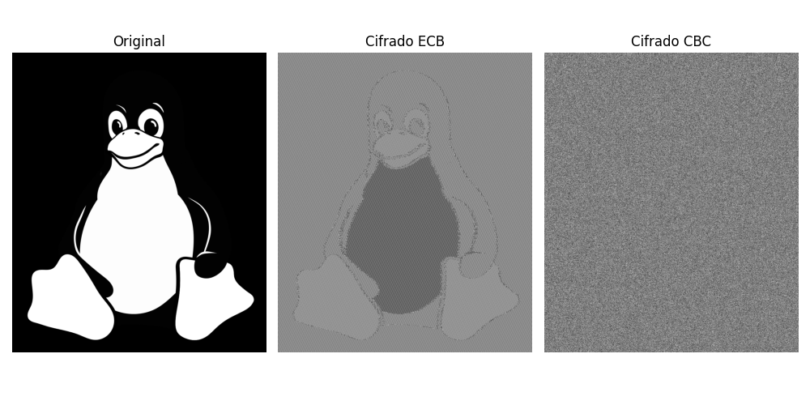
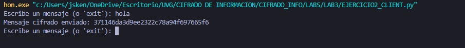
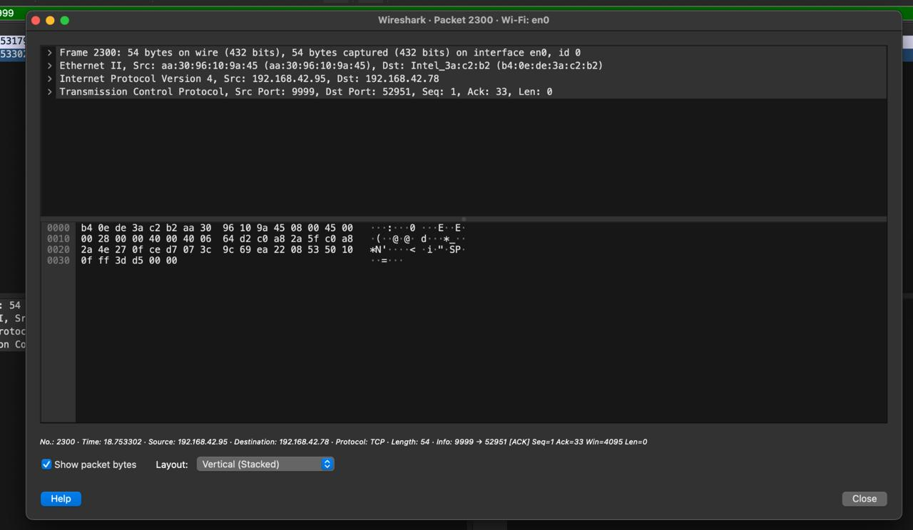
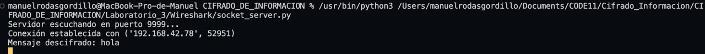
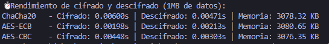
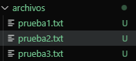
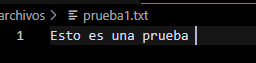
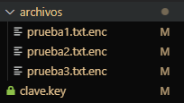
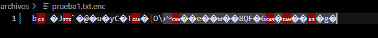

# 🔐 Seguridad en Cifrado: AES, ChaCha20 y Ransomware Simulado

## 📌 Parte 1: Cifrado de Imágenes con AES (ECB vs CBC)

### 🔹 Instrucciones
1. Utilizar una imagen BMP o PPM en escala de grises.
2. Cifrar la imagen con AES en modo ECB y visualizar el resultado.
3. Cifrar la misma imagen con AES en modo CBC y comparar.

### 📸 Resultados

### 🔹 Preguntas para reflexión

**¿Por qué el cifrado ECB revela los patrones de la imagen?**

El modo ECB (Electronic Codebook) cifra cada bloque de datos de manera independiente y sin variaciones entre bloques idénticos. Esto significa que si hay patrones repetidos en la imagen original, estos se mantendrán en la versión cifrada, lo que permite distinguir ciertas estructuras de la imagen incluso después del cifrado.

**¿Cómo cambia la apariencia con CBC?**

El modo CBC (Cipher Block Chaining) introduce aleatoriedad al cifrado porque cada bloque es afectado por el bloque anterior mediante un XOR con un vector de inicialización (IV). Como resultado, la imagen cifrada pierde patrones visibles y aparece como un ruido aleatorio, lo que mejora la seguridad y evita la exposición de estructuras en la imagen original.

**¿Qué tan seguro es usar ECB para cifrar datos estructurados?**

ECB es un modo de cifrado débil para datos estructurados porque no oculta patrones repetidos. Esto lo hace vulnerable a ataques de análisis de patrones y, por lo tanto, no se recomienda para información sensible. Es preferible utilizar modos como CBC o GCM, que introducen aleatoriedad y mayor seguridad.

---

## 📌 Parte 2: Capturando Cifrado en Red con Wireshark

### 🔹 Instrucciones
1. Crear un script que envíe mensajes cifrados con AES-CBC a un servidor.
2. Capturar el tráfico con Wireshark y analizar los paquetes.

### 📊 Análisis de Captura de Red

_Mensaje enviado por el cliente_

_Captura de wireshark con paquete enviado_

_Mensaje recibido por el servidor_

### 🔹 Preguntas para reflexión

**¿Se puede identificar que los mensajes están cifrados con AES-CBC?**

Sí, aunque el contenido del mensaje está cifrado y no puede leerse directamente, aún se pueden identificar ciertas características del tráfico que sugieren el uso de AES-CBC. 

**¿Cómo podríamos proteger más esta comunicación?**

Para aumentar la seguridad, se pueden implementar prácticas como el uso de TLS para cifrar toda la comunicación, añadir autenticación en los mensajes cifrados (como HMAC), o emplear cifrados con autenticación y confidencialidad, como AES-GCM, que evita modificaciones en los datos cifrados.

---

## 📌 Parte 3: Implementando un Cifrado de Flujo con ChaCha20

### 🔹 Instrucciones

1. Implementar ChaCha20 para cifrar y descifrar mensajes.

2. Comparar su rendimiento con AES en tiempos y consumo de memoria.

### ⚖ Comparación de Rendimiento

_Mediciones de tiempo y comparación entre algoritmos._

### 🔹 Preguntas para reflexión

**¿Qué cifrado es más rápido, ChaCha20 o AES?**

El cifrado más rápido fue el AES-EBC

**¿En qué casos debería usarse ChaCha20 en vez de AES?**

ChaCha20 es una mejor opción cuando se necesita un cifrado eficiente en software sin depender de hardware especializado. Es ampliamente utilizado en comunicaciones seguras como TLS y en aplicaciones móviles donde la eficiencia energética es clave.

---

## 📌 Parte 4: Implementación de un Ransomware Simulado

### 🔹 Instrucciones
1. Crear un script que cifre archivos de texto con AES.
2. Ejecutar el script en un folder con varios archivos.
3. Implementar una clave de descifrado en otro script.

### 🔓 Resultados de la Simulación

_Archivos txt sin cifrar_

_Ejemplo txt sin cifrar_

_Cifrado de archivos_

_Ejemplos de txt cifrado_

### 🔹 Preguntas para reflexión

**¿Cómo podríamos evitar ataques de ransomware?**

Para mitigar los ataques de ransomware, es crucial implementar copias de seguridad periódicas, mantener el software actualizado, utilizar soluciones de seguridad avanzadas y educar a los usuarios sobre el phishing y otras tácticas de ataque. 

**¿Qué tan importante es almacenar claves de manera segura?**

El almacenamiento seguro de claves es fundamental para evitar que un atacante pueda descifrar la información.
